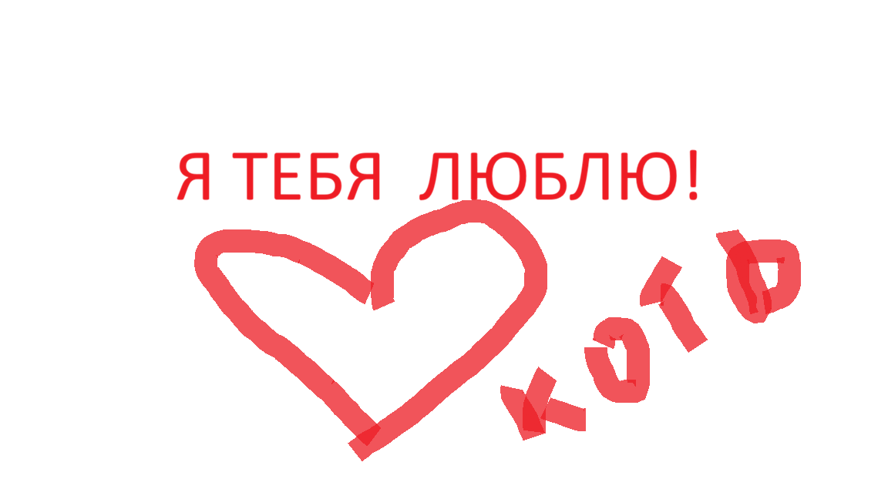

# Привет! Я — Ваше Имя

  
*Здесь должно быть моё фото (файл photo.jpg лежит в той же папке)*

## Обо мне
- 🎓 Студент Нетологии
- 💻 Начинающий разработчик
- 🌍 Живу в [ваш город]

## Мои навыки
- HTML, CSS, JavaScript (базовый уровень)
- Git и GitHub
- Работа с Markdown

## Мои цели
Хочу освоить веб-разработку и создавать полезные проекты. В планах выучить React и Node.js.

## Контакты
- Email: [ваша почта](mailto:example@mail.com)
- GitHub: [ваш профиль](https://github.com/ваш-ник)

---
*Сайт создан в рамках обучения в Нетологии.*